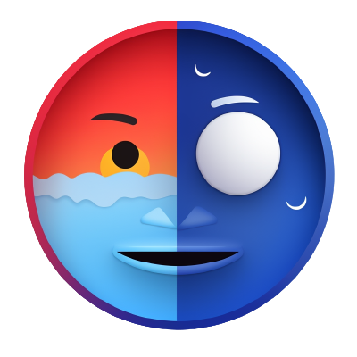

# MrWeather

Weather app with a 3D model rendered by Three.js. Key in location and get
weather data. Click MrWeather's face to visit demo.

    

## Project Overview

- Project written to practice React, API, testing, Three.js
- [Demo](https://mr-weather.vercel.app/)

## Tools

- [weather api](https://www.weatherapi.com/)
- [Three.js](https://threejs.org/docs/index.html#manual/en/introduction/Creating-a-scene)
- [styled-components](https://github.com/styled-components/styled-components)
- [RTL](https://testing-library.com/docs/react-testing-library/intro/)
- [msw](https://github.com/mswjs/msw)

## Info

- Vercel has issue with Git LFS which is needed for .glb file with size > 100
  MB. LFS reference file will be mistaken as .glb file during build. For
  deployment on Vercel, LFS has to be bypassed. This is achieved by compressing
  the .glb file and then decompressed with
  [Draco](https://github.com/google/draco). Decoder path:
  https://www.gstatic.com/draco/versioned/decoders/1.5.6/.
- Vite is reporting `"Two output files share the same path but have different contents"`
  error on `DRACOLoader`. Might be the casing of `DracoLoader` has been changed
  when writing the code; this does not appear to affect the functionality of the
  app.

## Credits

- 3D model ["...Fire in the sky"](https://skfb.ly/oCXvT) by WON is licensed
  under [Creative Commons
  Attribution](http://creativecommons.org/licenses/by/4.0/).
